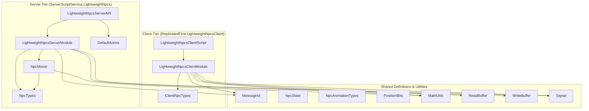

# Lightweight NPC Framework - Module Architecture & Dependencies

## 1. System Organization & Design Rationale

The framework is organized into three distinct tiers:
1. **Server Tier**: Handles public spawning interfaces, entity record lifetime management, simulation tick scheduling, and kinematic physics sweep movement.
2. **Client Tier**: Handles visual model instantiation, animation track loading, network packet decoding, timeline interpolation, and spatial culling.
3. **Shared Utility & Serialization Tier**: Handles binary buffer serialization (`ReadBuffer`/`WriteBuffer`), custom signal dispatching (`Signal`), mathematical helpers (`MathUtils`), type definitions, and protocol enums.



---

## 2. Module Specifications

### Server Modules

#### 1. `LightweightNpcsServerAPI.luau`
- **Purpose**: Public-facing entry point for game scripts to configure and spawn NPCs.
- **Responsibilities**:
  - Exposes config constructor `CreateConfig()`.
  - Exposes NPC spawning method `SpawnNpc()`.
  - Exposes spatial query lookup `GetNpcByHitbox()`.
- **Public API**:
  ```lua
  function module:CreateConfig(): NpcConfig
  function module:SpawnNpc(template: Model, configuration: any, position: Vector3, angleRad: number): NpcRecord
  function module:GetNpcByHitbox(hitbox: BasePart): NpcRecord?
  ```
- **Internal Responsibilities**: Validates `thinkHzRate` vs `replicationHzRate` configuration sanity.
- **Dependencies**: `DefaultAnims`, `LightweightNpcsServerModule`.
- **Dependents**: External game server scripts.

#### 2. `LightweightNpcsServerModule.luau`
- **Purpose**: Central server engine managing entity records, simulation loops, player connections, and buffer broadcasting.
- **Responsibilities**:
  - Manages `playerRecords` and `npcRecords` tables.
  - Connects to `RunService.Heartbeat` to drive `onThink` signals and `NpcMover:ProcessMovement`.
  - Serializes entity transform snapshots and animation events into binary buffers.
  - Broadcasts position and animation updates over `RemoteEvent` / `UnreliableRemoteEvent`.
- **Public API**:
  ```lua
  function module:CreateNpc(template: Instance, npcConfig: any, position: Vector3, angle: number): NpcRecord
  function module:DestroyNpc(npcRecord: NpcRecord): ()
  function module:SendInitialState(playerRecord: PlayerRecord, npcRecord: NpcRecord): ()
  function module:Heartbeat(dt: number): ()
  function module:CheckForHitpointDeath(npcRecord: NpcRecord): ()
  function module:CheckForCleanup(npcRecord: NpcRecord): boolean
  ```
- **Internal Responsibilities**: Creates server container `Workspace.DoNotReplicate` and instantiates remote events (`LightweightNpcsRemoteEvent`, `LightweightNpcsUnreliableRemoteEvent`).
- **Dependencies**: `MessageId`, `WriteBuffer`, `NpcTypes`, `Signal`, `NpcState`, `NpcMover`, `PositionBits`.
- **Dependents**: `LightweightNpcsServerAPI`.

#### 3. `NpcMover.luau`
- **Purpose**: Kinematic motion controller handling sweep movement, stepping over obstacles, falling gravity, and rotation.
- **Responsibilities**:
  - Implements `SweepMove` via `Workspace:Blockcast`.
  - Handles ground acceleration and friction via `MathUtils`.
  - Executes step-up algorithms for stairs and ramps.
  - Updates character facing angle towards target angle.
- **Public API**:
  ```lua
  function module:ProcessMovement(npcRecord: NpcRecord, dt: number): ()
  function module:HandleWalkingState(npcRecord: NpcRecord, dt: number): ()
  function module:HandleFallingState(npcRecord: NpcRecord, dt: number): ()
  function module:UpdateFacingAngle(npcRecord: NpcRecord, dt: number): ()
  function module:ProcessMotionVectorIntoVelocity(npcRecord: NpcRecord, dt: number): ()
  ```
- **Internal Responsibilities**: Fires `onBumpIntoWall`, `onCrashland`, and `onFellOffMap` signals.
- **Dependencies**: `NpcTypes`, `MathUtils`.
- **Dependents**: `LightweightNpcsServerModule`.

#### 4. `NpcTypes.luau`
- **Purpose**: Type definition table for server entity records, configuration schemas, and internal timers.
- **Dependencies**: `Signal`, `NpcState`, `NpcAnimationTypes`.
- **Dependents**: `LightweightNpcsServerModule`, `NpcMover`, `LightweightNpcsServerAPI`.

#### 5. `DefaultAnims.luau`
- **Purpose**: Table mapping default animation track names to Roblox Animation IDs.
- **Dependencies**: None.
- **Dependents**: `LightweightNpcsServerAPI`.

---

### Client Modules

#### 6. `LightweightNpcsClientModule.luau`
- **Purpose**: Main client controller handling network buffer decoding, timeline snapshot queueing, frame interpolation, animation playback, and spatial culling.
- **Responsibilities**:
  - Listens to `RemoteEvent` network messages from server (`InitialState`, `PositionBuffer`, `AnimationBuffer`, `Cleanup`).
  - Decodes binary buffers via `ReadBuffer`.
  - Interpolates character transforms across buffered timeline snapshots in `RunService.Heartbeat`.
  - Applies character visual transforms using `Model:PivotTo(CFrame)`.
- **Public API**:
  ```lua
  function module:ProcessPositionBuffer(buffer: buffer): ()
  function module:ProcessAnimationBuffer(buffer: buffer): ()
  function module:ProcessCleanup(npcId: number): ()
  function module:ProcessLoad(npcRecord: ClientNpcRecord): ()
  function module:StartAnimation(npcRecord: ClientNpcRecord, animationIndex: number, channel: number): ()
  function module:Heartbeat(dt: number): ()
  ```
- **Dependencies**: `MessageId`, `ReadBuffer`, `ClientNpcTypes`, `MathUtils`, `Signal`, `PositionBits`.
- **Dependents**: `LightweightNpcsClientScript`.

#### 7. `ClientNpcTypes.luau`
- **Purpose**: Type definitions for client entity records (`clientNpcRecordType`), timeline snapshot structs, and event queues.
- **Dependencies**: `Signal`, `NpcAnimationTypes`.
- **Dependents**: `LightweightNpcsClientModule`.

---

### Shared Utilities & Enums

#### 8. `MessageId.luau`
- **Purpose**: Enum mapping message names to numerical byte IDs (`InitialState = 1`, `Welcome = 2`, `PositionBuffer = 3`, `AnimationBuffer = 4`, `Cleanup = 5`, `CustomClientEvent = 6`).
- **Dependents**: `LightweightNpcsServerModule`, `LightweightNpcsClientModule`.

#### 9. `ReadBuffer.luau` & `WriteBuffer.luau`
- **Purpose**: Custom binary buffer stream reader and writer wrappers over native Luau `buffer` library. Supports Float16, Float32, Vector3, AxisAngle, Int8/16/32.
- **Dependents**: `LightweightNpcsServerModule`, `LightweightNpcsClientModule`.

#### 10. `MathUtils.luau`
- **Purpose**: Math helper library providing angle wrapping (`AngleAbs`, `AngleShortest`), ground acceleration (`GroundAccelerate`), velocity friction (`VelocityFriction`), and vector flattening (`FlatVec`).
- **Dependents**: `NpcMover`, `LightweightNpcsClientModule`.

#### 11. `Signal.luau`
- **Purpose**: Custom double-linked-list implementation of Lua signals (`Connect`, `Fire`, `Wait`, `Destroy`).
- **Dependents**: `LightweightNpcsServerModule`, `LightweightNpcsClientModule`, `NpcTypes`, `ClientNpcTypes`.

---
*Cross-References*:
- For high-level overview, see [overview.md](file:///C:/Users/Thiago/source/repos/Roblox/rblx-rrw-template/docs/LightweightNpcs/overview.md).
- For runtime execution lifecycle, see [runtime.md](file:///C:/Users/Thiago/source/repos/Roblox/rblx-rrw-template/docs/LightweightNpcs/runtime.md).
- For weakness evaluation and design critique, see [improvements.md](file:///C:/Users/Thiago/source/repos/Roblox/rblx-rrw-template/docs/LightweightNpcs/improvements.md).
