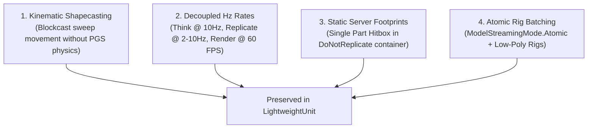

# Lightweight NPC Framework - Evaluation, Flaws & Improvements

## 1. Executive Summary & Evaluation Rationale

This document provides a critical architectural evaluation of the imported `LightweightNpcs/` codebase. Every identified flaw is analyzed in detail: explaining the root cause, measuring its technical impact, proposing alternative engineering designs, and weighing the trade-offs.

Additionally, concepts that the current implementation handles exceptionally well are highlighted for preservation in the upcoming **LightweightUnit** framework.

---

## 2. Comprehensive Weakness & Improvement Matrix

### Flaw 1: Animation Broadcast Buffer Clearing Bug (Critical Defect)
- **Problem**: In `LightweightNpcsServerModule.luau` (lines 549–576), `npcRecord.internal.pendingAnimationChanges` is reset to `{}` inside the loop iterating over connected players.
- **Impact**: The first player processed in `self.playerRecords` receives animation updates, but all subsequent players in the loop receive empty animation buffers. Animations desync completely for multi-player sessions.
- **Alternative Design**:
  1. *Per-Player Queue*: Maintain `pendingAnimationChanges: { [Player]: { [channel]: animIndex } }`.
  2. *Zap Broadcast*: Stream animation state events via Zap reliable events (`UnitAnimationBatch`), eliminating manual state clearing.
- **Trade-Off**: Per-player tracking uses slightly more server memory, but guarantees 100% reliable packet delivery to all clients.

---

### Flaw 2: Visibility Flag Truthiness Mismatch Bug
- **Problem**: `NpcTypes.luau` states that `nil` in `playerVisibleFlag[player]` defaults to `true` (visible). However, `LightweightNpcsServerModule.luau` checks `if npcRecord.internal.playerVisibleFlag[player] == true`. In Lua, `nil == true` evaluates to `false`.
- **Impact**: Newly created NPCs or joining players never receive position or animation updates because `nil == true` fails.
- **Alternative Design**: Use an explicit getter method `npcRecord:getPlayerVisibleFlag(player)` or initialize `playerVisibleFlag[player] = true` inside `PlayerConnected`.
- **Trade-Off**: Negligible CPU cost; eliminates silent entity replication failures.

---

### Flaw 3: Player Disconnect Memory Leak & Join Crash
- **Problem**: `PlayerDisconnected` sets `playerRecord.ready = false` but fails to clear `self.playerRecords[player] = nil`.
- **Impact**: Memory leak when players leave. Furthermore, when a player rejoins in the same server session, `assert(self.playerRecords[player] == nil)` inside `PlayerConnected` throws a fatal error.
- **Alternative Design**: Cleanly set `self.playerRecords[player] = nil` and purge player entries from `playerVisibleFlag` tables in `PlayerDisconnected`.
- **Trade-Off**: Ensures clean garbage collection and crash-free player re-joins.

---

### Flaw 4: $O(N)$ Timeline Array Shifting on Client
- **Problem**: `LightweightNpcsClientModule.luau` uses `table.remove(npcRecord.timeline, 1)` inside a `while` loop on every heartbeat frame to trim old snapshots.
- **Impact**: `table.remove(..., 1)` re-indexes every element in the array, causing an $O(N)$ memory shift penalty per entity. With 200+ entities, this degrades client framerates.
- **Alternative Design**: Implement a fixed-capacity **Ring Buffer** with head/tail integer pointers, achieving true $O(1)$ push and pop operations.
- **Trade-Off**: Requires slightly more initial code complexity, but delivers massive CPU performance gains on the client.

---

### Flaw 5: Expensive Model Parent Toggling for Culling
- **Problem**: When a timeline overrun occurs or an entity moves out of range, the client toggling model visibility by setting `instance.Parent = nil` and reparenting to `Workspace` when visible.
- **Impact**: Toggling parents on atomic models forces Roblox to recalculate spatial trees, redraw textures, and rebuild rendering fast-clusters, causing severe frame hitches.
- **Alternative Design**: Maintain models in `Workspace.Npcs` container and hide them by moving CFrame off-screen (`PivotTo(CFrame.new(0, -9999, 0))`) or setting model transparency.
- **Trade-Off**: Saves scene-graph rebuild hitches; off-screen CFrames carry zero visual render cost.

---

### Flaw 6: Deprecated Engine Time API (`tick()`)
- **Problem**: Server and client modules rely on `tick()` for server time offset and delta calculations.
- **Impact**: `tick()` is deprecated in modern Luau. It relies on local machine time, which suffers from clock drift between server and client devices.
- **Alternative Design**: Migrate to `workspace:GetServerTimeNow()` for networked clock synchronization and `os.clock()` for local frame benchmarks.
- **Trade-Off**: Guarantees sub-millisecond network clock synchronization across all platforms.

---

### Flaw 7: DataModel Path Requires & `ReplicatedFirst` Abuse
- **Problem**: Code is organized under root `LightweightNpcs/` and server scripts execute `require(game.ReplicatedFirst.LightweightNpcsClient...)`.
- **Impact**: Violates project directory architecture ([architecture.md](file:///C:/Users/Thiago/source/repos/Roblox/rblx-rrw-template/docs/architecture.md)) and prevents clean modular unit testing.
- **Alternative Design**: Move files into `src/client/`, `src/server/`, and `src/shared/`, using relative file paths or Rojo package mapping.
- **Trade-Off**: Enforces rigid separation of concerns and prevents code leakage.

---

## 3. Preserved Framework Strengths

The following core concepts in `LightweightNpcs/` are exceptionally well-engineered and **should be preserved** in **LightweightUnit**:

1. **Kinematic Shapecasting Movement (`NpcMover`)**:
   - *Why Preserve*: Completely eliminates server physics assembly overhead while maintaining realistic ground movement, stepping over obstacles, and gravity.
2. **Decoupled Hertz Simulation & Replication**:
   - *Why Preserve*: Allows game logic to simulate at high responsiveness (10Hz+) while conserving network bandwidth by replicating transforms at lower frequencies (2Hz - 5Hz).
3. **Static Server Footprint**:
   - *Why Preserve*: Keeping visual models in `ReplicatedStorage` and running server checks on a single anchored `Part` hitbox allows scaling to 1,000+ entities.
4. **Snapshot Timeline Interpolation**:
   - *Why Preserve*: Provides butter-smooth 60 FPS visual motion on clients despite low network update rates over unreliable channels.

---
*Cross-References*:
- For target architecture, see [architecture.md](file:///C:/Users/Thiago/source/repos/Roblox/rblx-rrw-template/docs/LightweightNpcs/architecture.md).
- For replacement framework design, see [migration.md](file:///C:/Users/Thiago/source/repos/Roblox/rblx-rrw-template/docs/LightweightNpcs/migration.md).
- For networking redesign, see [networking.md](file:///C:/Users/Thiago/source/repos/Roblox/rblx-rrw-template/docs/LightweightNpcs/networking.md).
