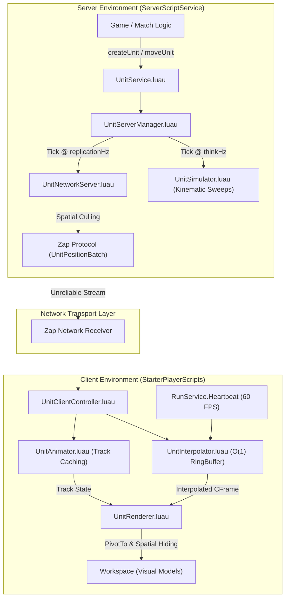

# LightweightUnit - System Overview & File Structure

## 1. Executive Summary

**LightweightUnit** is the modern replacement framework designed to supersede `LightweightNpcs/` as outlined in [migration.md](file:///C:/Users/Thiago/source/repos/Roblox/rblx-rrw-template/docs/LightweightNpcs/migration.md).

It is a generalized, high-performance entity simulation, networking, and rendering engine. Instead of assuming entities are NPC characters with hitpoints and simple pathing, **LightweightUnit** provides a universal foundation capable of representing **any networked entity in the football engine**—including human players, AI players, goalkeepers, referees, stadium spectators, training dummies, and match balls.

---

## 2. Complete File Structure Map

The framework strictly adheres to the project's directory structure defined in [architecture.md](file:///C:/Users/Thiago/source/repos/Roblox/rblx-rrw-template/docs/architecture.md) and coding guidelines in [naming-table.md](file:///C:/Users/Thiago/source/repos/Roblox/rblx-rrw-template/docs/naming-table.md):

```text
root/
├── zap/
│   └── unit-replication.zap               # Zap binary network declarations
│
├── src/
│   ├── shared/                            # Universal Types & Shared Core Utilities
│   │   ├── Types/
│   │   │   └── UnitTypes.luau             # Universal type definitions (UnitRecord, UnitConfig, UnitState)
│   │   ├── Definitions/
│   │   │   └── UnitDefinitions.luau       # Archetype configs (Player, Goalkeeper, Referee, Spectator)
│   │   ├── Core/
│   │   │   ├── MathUtils.luau             # FlatVec, GroundAccelerate, AngleShortest, SmoothLerp
│   │   │   ├── RingBuffer.luau            # Constant-time O(1) snapshot timeline queue
│   │   │   └── Signal.luau                # Fast double-linked-list event signal
│   │   └── Network/
│   │       └── Generated/                 # Zap generated client networking
│   │
│   ├── server/                            # Proprietary Server Engine Logic
│   │   ├── Game/
│   │   │   └── Unit/
│   │   │       ├── UnitService.luau       # Public server API (createUnit, destroyUnit, moveUnit)
│   │   │       ├── UnitServerManager.luau # Lifetime management & server tick loop
│   │   │       ├── UnitSimulator.luau     # Kinematic physics sweep & ground acceleration solver
│   │   │       └── UnitNetworkServer.luau # Per-player visibility culling & Zap replication
│   │   └── Network/
│   │       └── Generated/                 # Zap generated server networking
│   │
│   └── client/                            # Client Presentation & Interpolation Layer
│       └── Game/
│           └── Unit/
│               ├── UnitClientController.luau # Client entry point & handshake
│               ├── UnitInterpolator.luau     # Timeline sampling & fraction lerping
│               ├── UnitAnimator.luau         # Animator track loading & channel blending
│               └── UnitRenderer.luau         # Visual model PivotTo & off-screen culling
```

---

## 3. High-Level Architecture & Communication Flow



---

## 4. Subsystem Documentation Map

For detailed in-depth code documentation, module specifications, and implementation designs, refer to:

- 🖥️ **[server.md](file:///C:/Users/Thiago/source/repos/Roblox/rblx-rrw-template/docs/LightweightNpcs/in-depth/server.md)**: Public server API (`UnitService`), lifetime management (`UnitServerManager`), kinematic physics solver (`UnitSimulator`), and spatial replication (`UnitNetworkServer`).
- 🌐 **[shared.md](file:///C:/Users/Thiago/source/repos/Roblox/rblx-rrw-template/docs/LightweightNpcs/in-depth/shared.md)**: Universal types (`UnitTypes`), archetype definitions (`UnitDefinitions`), math helpers (`MathUtils`), $O(1)$ ring buffer (`RingBuffer`), signal dispatcher (`Signal`), and Zap network definitions (`unit-replication.zap`).
- 📱 **[client.md](file:///C:/Users/Thiago/source/repos/Roblox/rblx-rrw-template/docs/LightweightNpcs/in-depth/client.md)**: Client presentation controller (`UnitClientController`), snapshot timeline interpolation (`UnitInterpolator`), animation track blending (`UnitAnimator`), and visual model rendering (`UnitRenderer`).

---
*Cross-References*:
- [Migration Vision](file:///C:/Users/Thiago/source/repos/Roblox/rblx-rrw-template/docs/LightweightNpcs/migration.md)
- [Project Architecture Rules](file:///C:/Users/Thiago/source/repos/Roblox/rblx-rrw-template/docs/architecture.md)
- [Naming Guidelines](file:///C:/Users/Thiago/source/repos/Roblox/rblx-rrw-template/docs/naming-table.md)
