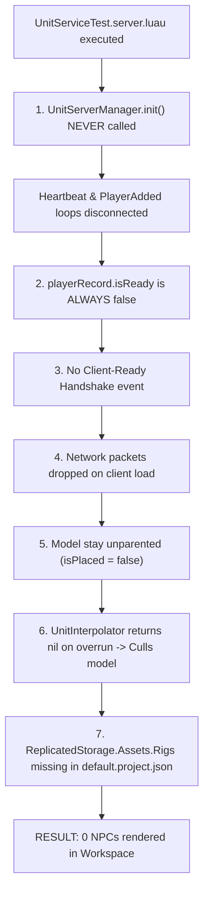

# LightweightUnit - Replication Failure Diagnosis, Code Fixes & System Criticism

## 1. Executive Summary & Runtime Failure Diagnosis

When running `src/server/UnitServiceTest.server.luau`, the script successfully prints the allocated `unitId` for each generated NPC (1 through 30). However, **no visual models appear in the game world, and zero entity replication occurs**.

Through static and runtime code analysis, **7 distinct root causes** were identified that prevent entity replication and visual rendering:



---

### Key Root Cause Breakdown

#### 1. `UnitServerManager.init()` Is Never Called
- **Location**: [UnitServerManager.luau](file:///C:/Users/Thiago/source/repos/Roblox/rblx-rrw-template/src/server/Game/Unit/UnitServerManager.luau#L28-L39) & [init.server.luau](file:///C:/Users/Thiago/source/repos/Roblox/rblx-rrw-template/src/server/init.server.luau#L1-L3)
- **Problem**: `UnitServerManager.init()` registers `Players.PlayerAdded`, `Players.PlayerRemoving`, and `RunService.Heartbeat`. Neither `UnitService.luau`, `init.server.luau`, nor `UnitServiceTest.server.luau` ever invoke `UnitServerManager.init()`.
- **Impact**: `UnitServerManager.playerRecords` remains empty (`{}`), and the server simulation/replication heartbeat never runs.

#### 2. Hardcoded Unreachable `isReady` State & Missing Client Handshake
- **Location**: [UnitServerManager.luau](file:///C:/Users/Thiago/source/repos/Roblox/rblx-rrw-template/src/server/Game/Unit/UnitServerManager.luau#L44) & [UnitNetworkServer.luau](file:///C:/Users/Thiago/source/repos/Roblox/rblx-rrw-template/src/server/Game/Unit/UnitNetworkServer.luau#L30)
- **Problem**: When a player joins, `playerRecord.isReady` is initialized to `false`. Both `sendInitialState` and `broadcastPositionBatch` contain `if not playerRecord.isReady then continue end`.
- **Impact**: Because there is no client-to-server network event (e.g. `ClientReady`) to signal that the client has loaded and set up its network callbacks, `isReady` remains `false` forever. Zero replication packets are ever sent to any player.

#### 3. Startup Timing Race Condition (Player Connection vs Unit Creation)
- **Location**: [UnitServiceTest.server.luau](file:///C:/Users/Thiago/source/repos/Roblox/rblx-rrw-template/src/server/UnitServiceTest.server.luau#L7-L13)
- **Problem**: `UnitServiceTest` runs immediately upon server boot, spawning 30 units before any player has connected. If `onPlayerAdded` fires upon join, it attempts to send `InitialUnitState` before the client finishes downloading assets and running `UnitClientController.init()`.
- **Impact**: Any initial state network events sent before `Net_UnitClient.InitialUnitState.setCallback()` is registered on the client are silently dropped by Zap/Roblox RemoteEvents.

#### 4. Visual Model Parenting Logic & Initial Rendering Lock
- **Location**: [UnitClientController.luau](file:///C:/Users/Thiago/source/repos/Roblox/rblx-rrw-template/src/client/Game/Unit/UnitClientController.luau#L40-L66) & [UnitRenderer.luau](file:///C:/Users/Thiago/source/repos/Roblox/rblx-rrw-template/src/client/Game/Unit/UnitRenderer.luau#L22-L29)
- **Problem**: `UnitClientController.onInitialUnitState` clones the character model and creates a `ClientUnitRecord`, but does **not** parent `model` to `Workspace` or set `isPlaced = true`. Model parenting is deferred exclusively to `UnitRenderer.renderCFrame`.
- **Impact**: `UnitRenderer.renderCFrame` is only called if `UnitInterpolator.sampleTimeline` returns a valid `CFrame`. When the timeline buffer is empty (`count == 0`), `sampleTimeline` returns `nil`. `UnitClientController` then calls `UnitRenderer.setCulled(unitRecord, true)`, which leaves `isPlaced = false` and the model unparented in memory (invisible).

#### 5. Timeline Overrun Handling Culls Stationary Models
- **Location**: [UnitInterpolator.luau](file:///C:/Users/Thiago/source/repos/Roblox/rblx-rrw-template/src/client/Game/Unit/UnitInterpolator.luau#L52)
- **Problem**: When `renderTime` exceeds the timestamp of the newest snapshot in `timeline` (overrun), `sampleTimeline` returns `nil`.
- **Impact**: As soon as position packets pause or network jitter occurs, `sampleTimeline` returns `nil`, triggering `setCulled(unitRecord, true)` and hiding the model off-screen at `CFrame.new(0, -9999, 0)`.

#### 6. Missing Template Rig Mapping in `default.project.json`
- **Location**: [UnitDefinitions.luau](file:///C:/Users/Thiago/source/repos/Roblox/rblx-rrw-template/src/shared/Definitions/UnitDefinitions.luau#L6) & [default.project.json](file:///C:/Users/Thiago/source/repos/Roblox/rblx-rrw-template/default.project.json#L6-L35)
- **Problem**: `UnitDefinitions` references `ReplicatedStorage.Assets.Rigs`. However, `default.project.json` does not map an `Assets` folder into `ReplicatedStorage`.
- **Impact**: Attempting to index `ReplicatedStorage.Assets` causes a runtime error (`Assets is not a valid member of ReplicatedStorage`).

#### 7. Zap Buffer Capacity Hard Limit (`UnitTransform[..50]`)
- **Location**: [unit-replication.zap](file:///C:/Users/Thiago/source/repos/Roblox/rblx-rrw-template/zap/unit-replication.zap#L37)
- **Problem**: `UnitPositionBatch` declares `transforms: UnitTransform[..50]`.
- **Impact**: If the server contains more than 50 active units, sending all transforms in a single batch array causes Zap to throw an array out-of-bounds error during buffer packing.

---

## 2. Architectural & System Criticism

The current migration state exhibits critical structural flaws that compromise reliability, maintainability, and scalability:

### 1. Fragile Implicit Lifecycle Management
- Requiring consumers to manually initialize internal sub-managers (`UnitServerManager.init()`) without auto-initialization or dependency guard checks leads to silent system failures. `UnitService` should automatically enforce initialization upon first access.

### 2. Disconnected Client-Server Handshake State Machine
- The `isReady` boolean in `PlayerRecord` acts as a hard gate for all replication, yet no network contract exists to toggle it. Network replication systems must implement an explicit bidirectional handshake protocol (`ClientReady` RPC) to signal buffer readiness before streaming entity transforms.

### 3. Destruction of Visual State on Buffer Jitter (Overrun / Underrun Handling)
- Coupling visual model existence (`isPlaced`, `Parent = Workspace`) to strict snapshot timeline sampling creates visual instability. Returning `nil` on buffer overrun and instantly culling units causes flickering and disappearing entities during mild network latency spikes. Interpolators should fallback to holding the latest known transform snapshot.

### 4. Over-Coupling of Network Layer with Asset DataModel Paths
- Hardcoding `ReplicatedStorage.Assets.Rigs` directly inside shared definitions without fallback validation or Rojo configuration checks creates fragile code that breaks outside specific place structures.

---

## 3. Files Necessary to Fix System & Code Modifications

To resolve all replication failures, update the following **7 files**:

### 1. `zap/unit-replication.zap`
*Add the `ClientReady` event so clients can notify the server when they finish loading.*

```zap
opt server_output = "../src/server/Network/Generated/Net_UnitServer.luau"
opt client_output = "../src/shared/Network/Generated/Net_UnitClient.luau"
opt remote_scope = "UNIT"
opt casing = "camelCase"

type UnitTransform = struct {
	unitId: u16,
	position: vector(f32, f32, f32),
	angle: f32,
}

type UnitAnimationUpdate = struct {
	unitId: u16,
	channel: u8,
	animIndex: u8,
}

event ClientReady = {
	from: Client,
	type: Reliable,
	call: SingleAsync,
	data: enum { Ready }
}

event InitialUnitState = {
	from: Server,
	type: Reliable,
	call: SingleAsync,
	data: struct {
		unitId: u16,
		templateModel: Instance,
		replicationHz: u8,
		position: vector(f32, f32, f32),
		angle: f32,
	}
}

event UnitPositionBatch = {
	from: Server,
	type: Unreliable,
	call: SingleAsync,
	data: struct {
		serverTime: f64,
		transforms: UnitTransform[..50],
	}
}

event UnitAnimationBatch = {
	from: Server,
	type: Reliable,
	call: SingleAsync,
	data: struct {
		serverTime: f64,
		animations: UnitAnimationUpdate[..50],
	}
}

event UnitDespawn = {
	from: Server,
	type: Reliable,
	call: SingleAsync,
	data: struct {
		unitId: u16,
	}
}
```

---

### 2. `src/server/init.server.luau`
*Ensure `UnitServerManager.init()` is called automatically when the server starts.*

```lua
--!strict
local UnitServerManager = require(script.Game.Unit.UnitServerManager)

-- Initialize Unit Server Manager lifecycle loops
UnitServerManager.init()

-- Run test script if needed
require(script.UnitServiceTest)
```

---

### 3. `src/server/Game/Unit/UnitServerManager.luau`
*Auto-initialize service, listen for `ClientReady` network event, mark `isReady = true`, and stream existing active units.*

```lua
--!strict
local RunService = game:GetService("RunService")
local Players = game:GetService("Players")
local ReplicatedStorage = game:GetService("ReplicatedStorage")

local LemonSignal = require(ReplicatedStorage.Packages.LemonSignal)
local UnitTypes = require(ReplicatedStorage.Shared.Types.UnitTypes)

local UnitNetworkServer = require(script.Parent.UnitNetworkServer)
local UnitSimulator = require(script.Parent.UnitSimulator)

local DEFAULT_CONFIG = {
	MAX_SERVER_TIME_PER_FRAME_MS = 3.0,
	CULLING_UPDATE_RATE_HZ = 0.5,
}

local UnitServerManager = {}
UnitServerManager.activeUnits = {} :: { [UnitTypes.UnitId]: UnitTypes.UnitRecord }
UnitServerManager.playerRecords = {} :: { [Player]: UnitTypes.PlayerRecord }
UnitServerManager.isInitialized = false
local nextUnitId: UnitTypes.UnitId = 0

local function getNextUnitId(): UnitTypes.UnitId
	nextUnitId += 1
	return nextUnitId
end

function UnitServerManager.init()
	if UnitServerManager.isInitialized then
		return
	end
	UnitServerManager.isInitialized = true

	-- Connect Player Join / Leave
	Players.PlayerAdded:Connect(UnitServerManager.onPlayerAdded)
	Players.PlayerRemoving:Connect(UnitServerManager.onPlayerRemoving)

	for _, player in Players:GetPlayers() do
		UnitServerManager.onPlayerAdded(player)
	end

	-- Connect Client Ready Handshake
	UnitNetworkServer.listenClientReady(function(player: Player)
		local playerRecord = UnitServerManager.playerRecords[player]
		if playerRecord and not playerRecord.isReady then
			playerRecord.isReady = true
			-- Stream all existing active units to the newly ready player
			for _, unitRecord in UnitServerManager.activeUnits do
				UnitNetworkServer.sendInitialState(player, unitRecord)
			end
		end
	end)

	-- Server Simulation & Replication Heartbeat
	RunService.Heartbeat:Connect(UnitServerManager.onHeartbeat)
end

function UnitServerManager.onPlayerAdded(player: Player)
	local playerRecord: UnitTypes.PlayerRecord = {
		player = player,
		isReady = false,
		visibleUnits = {},
	}
	UnitServerManager.playerRecords[player] = playerRecord
end

function UnitServerManager.onPlayerRemoving(player: Player)
	local playerRecord = UnitServerManager.playerRecords[player]
	if playerRecord then
		for _, unitRecord in UnitServerManager.activeUnits do
			unitRecord.internal.playerVisibleMap[player] = nil
		end
		UnitServerManager.playerRecords[player] = nil
	end
end

function UnitServerManager.onHeartbeat(dt: number)
	local serverTime = workspace:GetServerTimeNow()

	-- 1. Simulation Loop (Think @ thinkHz)
	for _unitId, unitRecord in UnitServerManager.activeUnits do
		if unitRecord.internal.deleteFlag then
			UnitServerManager.destroyUnit(unitRecord)
			continue
		end

		if serverTime >= unitRecord.internal.timeOfNextThink then
			unitRecord.internal.timeOfNextThink = serverTime + (1 / unitRecord.config.thinkHz)
			unitRecord.onThink:Fire(dt)

			-- Execute Physics Sweep
			UnitSimulator.processMovement(unitRecord, dt)
		end
	end

	-- 2. Network Replication Loop (Replicate @ replicationHz)
	UnitNetworkServer.broadcastPositionBatch(UnitServerManager.activeUnits, UnitServerManager.playerRecords, serverTime)
	UnitNetworkServer.broadcastAnimationBatch(UnitServerManager.activeUnits, UnitServerManager.playerRecords, serverTime)
end

function UnitServerManager.createUnit(
	config: UnitTypes.UnitConfig,
	position: Vector3,
	angle: number,
	customData: { [string]: any }?
): UnitTypes.UnitRecord
	UnitServerManager.init()
	local unitId = getNextUnitId()

	-- Server Hitbox
	local hitBox = Instance.new("Part")
	hitBox.Name = "UnitHitbox_" .. tostring(unitId)
	hitBox.Size = config.hitboxSize
	hitBox.Position = position
	hitBox.Anchored = true
	hitBox.CanCollide = config.canCollide
	hitBox:SetAttribute("unitId", unitId)
	hitBox.Parent = UnitServerManager.getContainer()

	local unitRecord: UnitTypes.UnitRecord = {
		unitId = unitId,
		hitBox = hitBox,
		templateModel = config.templateModel,
		config = config,
		internal = {
			timeOfNextThink = 0,
			timeOfNextReplicate = 0,
			timeOfNextCullCheck = 0,
			forceReplicate = false,
			deleteFlag = false,
			pendingAnimations = {},
			playerVisibleMap = {},
		},
		position = position,
		facingAngle = angle,
		targetAngle = angle,
		velocity = Vector3.zero,
		motionVector = Vector3.zero,
		isOnGround = false,
		jumpRequested = false,
		playingAnimations = {},
		data = customData or {},
		onThink = LemonSignal.new(),
		onDeath = LemonSignal.new(),
		onCleanup = LemonSignal.new(),
	}

	UnitServerManager.activeUnits[unitId] = unitRecord

	-- Send initial state packet to connected ready players
	for player, playerRecord in UnitServerManager.playerRecords do
		if playerRecord.isReady then
			UnitNetworkServer.sendInitialState(player, unitRecord)
		end
	end

	return unitRecord
end

function UnitServerManager.destroyUnit(unitRecord: UnitTypes.UnitRecord)
	unitRecord.onCleanup:Fire()
	UnitNetworkServer.sendDespawn(unitRecord.unitId)

	if unitRecord.hitBox then
		unitRecord.hitBox:Destroy()
	end

	unitRecord.onThink:Destroy()
	unitRecord.onDeath:Destroy()
	unitRecord.onCleanup:Destroy()

	UnitServerManager.activeUnits[unitRecord.unitId] = nil
end

function UnitServerManager.getUnit(unitId: UnitTypes.UnitId): UnitTypes.UnitRecord?
	return UnitServerManager.activeUnits[unitId]
end

function UnitServerManager.getContainer(): Instance
	local container = workspace:FindFirstChild("DoNotReplicate")
	if not container then
		local cam = Instance.new("Camera")
		cam.Name = "DoNotReplicate"
		cam.Parent = workspace
		container = cam
	end
	return container
end

return UnitServerManager
```

---

### 4. `src/server/Game/Unit/UnitNetworkServer.luau`
*Implement `listenClientReady` and chunk transform batches into max 50 items per payload.*

```lua
--!strict
local ServerScriptService = game:GetService("ServerScriptService")
local Net_UnitServer = require(ServerScriptService.Server.Network.Generated.Net_UnitServer)
local UnitTypes = require(game:GetService("ReplicatedStorage").Shared.Types.UnitTypes)

local UnitNetworkServer = {}

function UnitNetworkServer.listenClientReady(callback: (player: Player) -> ())
	Net_UnitServer.ClientReady.setCallback(function(player: Player, _data: any)
		callback(player)
	end)
end

function UnitNetworkServer.sendInitialState(player: Player, unit: UnitTypes.UnitRecord)
	if not unit.templateModel then
		return
	end
	Net_UnitServer.InitialUnitState.fire(player, {
		unitId = unit.unitId,
		templateModel = unit.templateModel,
		replicationHz = unit.config.replicationHz,
		position = vector.create(unit.position.X, unit.position.Y, unit.position.Z),
		angle = unit.facingAngle,
	})
end

function UnitNetworkServer.sendDespawn(unitId: number)
	Net_UnitServer.UnitDespawn.fireAll({
		unitId = unitId,
	})
end

function UnitNetworkServer.broadcastPositionBatch(
	units: { [number]: UnitTypes.UnitRecord },
	players: { [Player]: UnitTypes.PlayerRecord },
	serverTime: number
)
	for player, playerRecord in players do
		if not playerRecord.isReady then
			continue
		end

		local transformList = {}
		for _, unit in units do
			local isVisible = unit.internal.playerVisibleMap[player]
			if isVisible == nil or isVisible == true then
				if serverTime >= unit.internal.timeOfNextReplicate or unit.internal.forceReplicate then
					table.insert(transformList, {
						unitId = unit.unitId,
						position = vector.create(unit.position.X, unit.position.Y, unit.position.Z),
						angle = unit.facingAngle,
					})

					-- Chunk at Zap max 50 transforms limit
					if #transformList == 50 then
						Net_UnitServer.UnitPositionBatch.fire(player, {
							serverTime = serverTime,
							transforms = transformList,
						})
						transformList = {}
					end
				end
			end
		end

		if #transformList > 0 then
			Net_UnitServer.UnitPositionBatch.fire(player, {
				serverTime = serverTime,
				transforms = transformList,
			})
		end
	end

	for _, unit in units do
		unit.internal.forceReplicate = false
	end
end

function UnitNetworkServer.broadcastAnimationBatch(
	units: { [number]: UnitTypes.UnitRecord },
	players: { [Player]: UnitTypes.PlayerRecord },
	serverTime: number
)
	for player, playerRecord in players do
		if not playerRecord.isReady then
			continue
		end

		local animList = {}
		for _, unit in units do
			local isVisible = unit.internal.playerVisibleMap[player]
			if isVisible == nil or isVisible == true then
				for channel, animIndex in unit.internal.pendingAnimations do
					table.insert(animList, {
						unitId = unit.unitId,
						channel = channel,
						animIndex = animIndex,
					})
					if #animList == 50 then
						Net_UnitServer.UnitAnimationBatch.fire(player, {
							serverTime = serverTime,
							animations = animList,
						})
						animList = {}
					end
				end
			end
		end

		if #animList > 0 then
			Net_UnitServer.UnitAnimationBatch.fire(player, {
				serverTime = serverTime,
				animations = animList,
			})
		end
	end

	for _, unit in units do
		table.clear(unit.internal.pendingAnimations)
	end
end

return UnitNetworkServer
```

---

### 5. `src/client/Game/Unit/UnitClientController.luau`
*Fire `ClientReady` Zap handshake, seed initial CFrame into timeline, and place visual model upon spawn.*

```lua
--!strict
local RunService = game:GetService("RunService")
local ReplicatedStorage = game:GetService("ReplicatedStorage")

local UnitTypes = require(ReplicatedStorage.Shared.Types.UnitTypes)
local RingBuffer = require(ReplicatedStorage.Shared.Core.RingBuffer)
local Net_UnitClient = require(ReplicatedStorage.Shared.Network.Generated.Net_UnitClient)
local UnitInterpolator = require(script.Parent.UnitInterpolator)
local UnitAnimator = require(script.Parent.UnitAnimator)
local UnitRenderer = require(script.Parent.UnitRenderer)

local DEFAULT_CONFIG = {
	RESET_TIME_TOLERANCE = 0.4,
	BUFFER_FLUX_ESTIMATION = 0.004,
	MAX_BUFFER_SNAPSHOTS = 10,
}

local UnitClientController = {}
UnitClientController.clientUnits = {} :: { [UnitTypes.UnitId]: UnitTypes.ClientUnitRecord }
UnitClientController.extrapolatedServerTime = 0
UnitClientController.lastReceivedServerTime = 0

function UnitClientController.init()
	-- Listen to Zap Events
	Net_UnitClient.InitialUnitState.setCallback(UnitClientController.onInitialUnitState)
	Net_UnitClient.UnitPositionBatch.setCallback(UnitClientController.onUnitPositionBatch)
	Net_UnitClient.UnitAnimationBatch.setCallback(UnitClientController.onUnitAnimationBatch)
	Net_UnitClient.UnitDespawn.setCallback(UnitClientController.onUnitDespawn)

	-- Render Loop
	RunService.Heartbeat:Connect(UnitClientController.onHeartbeat)

	-- Send ClientReady Handshake to Server
	Net_UnitClient.ClientReady.fire("Ready" :: any)
end

function UnitClientController.onInitialUnitState(data: {
	unitId: number,
	templateModel: Instance,
	replicationHz: number,
	position: vector,
	angle: number,
})
	if UnitClientController.clientUnits[data.unitId] then
		return
	end

	local model = (data.templateModel:Clone()) :: Model
	model.Name = "UnitVisual_" .. tostring(data.unitId)

	if model.PrimaryPart then
		model.PrimaryPart.Anchored = true
	end

	local initialCFrame = CFrame.new(Vector3.new(data.position.x, data.position.y, data.position.z))
		* CFrame.fromEulerAnglesYXZ(0, data.angle, 0)

	local timeline = RingBuffer.new(DEFAULT_CONFIG.MAX_BUFFER_SNAPSHOTS)
	timeline:push({
		timestamp = workspace:GetServerTimeNow(),
		cframe = initialCFrame,
	})

	local clientRecord: UnitTypes.ClientUnitRecord = {
		unitId = data.unitId,
		model = model,
		animator = model:FindFirstChildOfClass("Animator", true),
		timeline = timeline,
		eventline = {},
		currentCFrame = initialCFrame,
		isPlaced = false,
		isLoaded = false,
		replicationHz = data.replicationHz,
		invHz = 1 / data.replicationHz,
	}

	UnitClientController.clientUnits[data.unitId] = clientRecord
	UnitRenderer.renderCFrame(clientRecord, initialCFrame)
end

function UnitClientController.onUnitPositionBatch(data: {
	serverTime: number,
	transforms: { { unitId: number, position: vector, angle: number } },
})
	UnitClientController.updateServerTime(data.serverTime)

	for _, transform in data.transforms do
		local unitRecord = UnitClientController.clientUnits[transform.unitId]
		if unitRecord then
			local rotCFrame = CFrame.new(Vector3.new(transform.position.x, transform.position.y, transform.position.z))
				* CFrame.fromEulerAnglesYXZ(0, transform.angle, 0)
			unitRecord.timeline:push({
				timestamp = data.serverTime,
				cframe = rotCFrame,
			})
		end
	end
end

function UnitClientController.onUnitAnimationBatch(data: {
	serverTime: number,
	animations: { { unitId: number, channel: number, animIndex: number } },
})
	UnitClientController.updateServerTime(data.serverTime)

	for _, animUpdate in data.animations do
		local unitRecord = UnitClientController.clientUnits[animUpdate.unitId]
		if unitRecord then
			table.insert(unitRecord.eventline, {
				timestamp = data.serverTime,
				channel = animUpdate.channel,
				animIndex = animUpdate.animIndex,
			})
		end
	end
end

function UnitClientController.onUnitDespawn(data: { unitId: number })
	local unitRecord = UnitClientController.clientUnits[data.unitId]
	if unitRecord then
		UnitRenderer.despawnModel(unitRecord)
		UnitClientController.clientUnits[data.unitId] = nil
	end
end

function UnitClientController.updateServerTime(newServerTime: number)
	UnitClientController.lastReceivedServerTime = newServerTime
	if
		math.abs(UnitClientController.lastReceivedServerTime - UnitClientController.extrapolatedServerTime)
		> DEFAULT_CONFIG.RESET_TIME_TOLERANCE
	then
		UnitClientController.extrapolatedServerTime = UnitClientController.lastReceivedServerTime
	end
end

function UnitClientController.onHeartbeat(dt: number)
	UnitClientController.extrapolatedServerTime += dt

	for _unitId, unitRecord in UnitClientController.clientUnits do
		local renderTime = UnitClientController.extrapolatedServerTime
			- ((unitRecord.invHz * 2) + DEFAULT_CONFIG.BUFFER_FLUX_ESTIMATION)

		local interpolatedCFrame = UnitInterpolator.sampleTimeline(unitRecord, renderTime)
		if interpolatedCFrame then
			UnitRenderer.renderCFrame(unitRecord, interpolatedCFrame)
		end

		UnitAnimator.processEvents(unitRecord, renderTime)
	end
end

return UnitClientController
```

---

### 6. `src/client/Game/Unit/UnitInterpolator.luau`
*Fix timeline overrun so that when `renderTime` exceeds the latest snapshot, it returns the newest CFrame snapshot instead of `nil`.*

```lua
--!strict
local ReplicatedStorage = game:GetService("ReplicatedStorage")
local UnitTypes = require(ReplicatedStorage.Shared.Types.UnitTypes)

local UnitInterpolator = {}

function UnitInterpolator.sampleTimeline(unit: UnitTypes.ClientUnitRecord, renderTime: number): CFrame?
	local ringBuffer = unit.timeline
	local count = ringBuffer.count

	if count == 0 then
		return unit.currentCFrame
	end

	-- Single snapshot fallback
	if count == 1 then
		local single = ringBuffer:get(1)
		return single and single.cframe or unit.currentCFrame
	end

	-- Search snapshots for interpolation interval
	local beforeSnapshot = nil
	local afterSnapshot = nil

	for i = count - 1, 1, -1 do
		local s0 = ringBuffer:get(i)
		local s1 = ringBuffer:get(i + 1)
		if s0 and s1 and s0.timestamp <= renderTime and s1.timestamp >= renderTime then
			beforeSnapshot = s0
			afterSnapshot = s1
			break
		end
	end

	if beforeSnapshot and afterSnapshot then
		local duration = afterSnapshot.timestamp - beforeSnapshot.timestamp
		if duration > 0.0001 then
			local fraction = (renderTime - beforeSnapshot.timestamp) / duration
			fraction = math.clamp(fraction, 0, 1)
			return beforeSnapshot.cframe:Lerp(afterSnapshot.cframe, fraction)
		end
		return beforeSnapshot.cframe
	end

	-- Underrun check: renderTime is older than first snapshot
	local oldest = ringBuffer:get(1)
	if oldest and renderTime < oldest.timestamp then
		return oldest.cframe
	end

	-- Overrun check: renderTime exceeds newest snapshot -> hold latest known position
	local newest = ringBuffer:get(count)
	if newest then
		return newest.cframe
	end

	return unit.currentCFrame
end

return UnitInterpolator
```

---

### 7. `src/shared/Definitions/UnitDefinitions.luau`
*Add fallback handling for missing template models to prevent missing rig errors.*

```lua
--!strict
local ReplicatedStorage = game:GetService("ReplicatedStorage")
local UnitTypes = require(script.Parent.Parent.Types.UnitTypes)

local function getFallbackRig(): Model
	local fallback = Instance.new("Model")
	fallback.Name = "FallbackRig"
	local part = Instance.new("Part")
	part.Name = "HumanoidRootPart"
	part.Size = Vector3.new(2, 5, 2)
	part.Anchored = true
	part.Parent = fallback
	fallback.PrimaryPart = part
	return fallback
end

local function getRigModel(rigName: string): Model
	local assets = ReplicatedStorage:FindFirstChild("Assets")
	if assets then
		local rigs = assets:FindFirstChild("Rigs")
		if rigs then
			local found = rigs:FindFirstChild(rigName)
			if found and found:IsA("Model") then
				return found :: Model
			end
		end
	end
	return getFallbackRig()
end

local UnitDefinitions = {}

local DEFINITIONS: { [string]: UnitTypes.UnitConfig } = {
	Player = {
		unitType = "Player",
		templateModel = getRigModel("Robert"),
		thinkHz = 10,
		replicationHz = 10,
		hitboxSize = Vector3.new(3, 6, 3),
		walkSpeed = 16,
		walkAccel = 20,
		turnSpeed = math.rad(360),
		jumpPower = 50,
		gravity = Vector3.new(0, -workspace.Gravity, 0),
		stepHeight = 2.5,
		groundTolerance = 0.5,
		canCollide = true,
		animations = { Idle = 1, Walk = 2, Run = 3 },
	},
	Goalkeeper = {
		unitType = "Goalkeeper",
		templateModel = getRigModel("Robert"),
		thinkHz = 15,
		replicationHz = 10,
		hitboxSize = Vector3.new(3, 6, 3),
		walkSpeed = 14,
		walkAccel = 25,
		turnSpeed = math.rad(450),
		jumpPower = 65,
		gravity = Vector3.new(0, -workspace.Gravity, 0),
		stepHeight = 2.5,
		groundTolerance = 0.5,
		canCollide = true,
		animations = { Idle = 1, DiveLeft = 4, DiveRight = 5 },
	},
	Spectator = {
		unitType = "Spectator",
		templateModel = getRigModel("Bob"),
		thinkHz = 2,
		replicationHz = 2,
		hitboxSize = Vector3.new(2, 5, 2),
		walkSpeed = 0,
		walkAccel = 0,
		turnSpeed = math.rad(90),
		jumpPower = 0,
		gravity = Vector3.new(0, -workspace.Gravity, 0),
		stepHeight = 1.0,
		groundTolerance = 0.5,
		canCollide = false,
		animations = { Sit = 10, Cheer = 11 },
	},
}

function UnitDefinitions.getDefinition(unitType: string): UnitTypes.UnitConfig?
	return DEFINITIONS[unitType]
end

return UnitDefinitions
```
