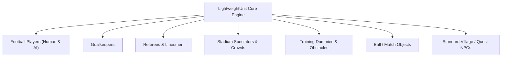
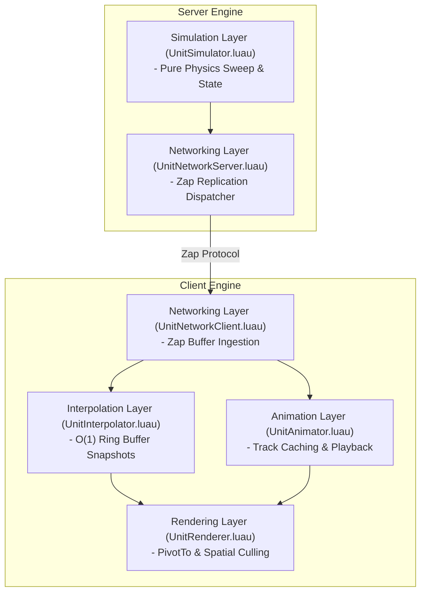

# LightweightUnit Framework - Migration & Architectural Specification

## 1. Vision & Strategic Objectives

The target of this redesign is **not** to create a refined port of `LightweightNpcs/`. Instead, we synthesize its effective concepts (kinematic shapecasting, decoupled think/replication loops, and snapshot interpolation) into a generalized engine subsystem: **LightweightUnit**.

While `LightweightNpcs/` assumed entities were non-player characters with hitpoints and simple pathing, **LightweightUnit** is designed as a universal, lightweight entity presentation and networking layer capable of driving **any networked entity in the football engine**:



---

## 2. Design Goals & Core Principles

1. **Universal Entity Representation**: Single unified pipeline for all simulated and rendered world entities.
2. **Strict Decoupled Responsibilities**: Simulation, Rendering, Networking, Animation, and State Management sit in isolated, single-responsibility modules.
3. **Engine Integration (Non-Isolated Architecture)**: Integrates directly into the game engine's shared network layer (**Zap**), signal architecture, and upcoming **Entity Component System (ECS)** match simulation engine.
4. **Zero Accidental Allocations**: Replaces dynamic array shifting (`table.remove`) with $O(1)$ ring buffers and uses zero-reparenting spatial culling.
5. **Strict Type Safety & Naming Compliance**: Full adherence to [naming-table.md](file:///C:/Users/Thiago/source/repos/Roblox/rblx-rrw-template/docs/naming-table.md) (`PascalCase` types, `camelCase` methods, `UPPER_SNAKE_CASE` constants).

---

## 3. Public API Specification

The `LightweightUnit` public API exposes a clean, intuitive surface for game services and simulation systems:

```lua
-- src/shared/Types/UnitTypes.luau
export type UnitId = number

export type UnitState = {
    position: Vector3,
    velocity: Vector3,
    facingAngle: number,
    animationChannelState: { [number]: number },
}

export type UnitConfig = {
    unitType: string,
    templateModel: Model,
    thinkHz: number,
    replicationHz: number,
    hitboxSize: Vector3,
    customData: { [string]: any },
}
```

```lua
-- src/server/Game/Unit/UnitService.luau (Server API)
local UnitService = {}

function UnitService.createUnit(config: UnitConfig, initialTransform: CFrame): UnitId
end

function UnitService.destroyUnit(unitId: UnitId): ()
end

function UnitService.setState(unitId: UnitId, newState: Partial<UnitState>): ()
end

function UnitService.moveUnit(unitId: UnitId, motionVector: Vector3): ()
end

function UnitService.setComponent(unitId: UnitId, componentName: string, componentData: any): ()
end

function UnitService.getComponent<T>(unitId: UnitId, componentName: string): T?
end

return UnitService
```

---

## 4. Decoupled Responsibility Matrix



| Subsystem Module | Responsibility Boundary | Strict Prohibitions |
| :--- | :--- | :--- |
| **`UnitSimulator`** | Kinematic physics sweep, velocity calculations, ground friction. | **No** Roblox Model references, **No** Client RPC code. |
| **`UnitNetworkServer`** | Serializes state diffs using Zap; handles per-player visibility spatial culling. | **No** physics calculations, **No** AI decision logic. |
| **`UnitInterpolator`** | Samples buffered snapshots using $O(1)$ ring buffer lookups at `renderTime`. | **No** direct CFrame mutation on Workspace models. |
| **`UnitAnimator`** | Loads animations onto `Animator` instances; manages multi-channel track blending. | **No** position or transform processing. |
| **`UnitRenderer`** | Applies final interpolated CFrame to visual model via `PivotTo`; handles off-screen culling. | **No** network decoding or snapshot math. |

---

## 5. System Extensibility & Engine Integration

### 1. ECS (Entity Component System) Integration
`LightweightUnit` is structured to act as the presentation & spatial backing store for an ECS match simulation engine:
- Server ECS systems (e.g. `PositionSystem`, `StaminaSystem`, `BallPossessionSystem`) mutate data components attached to a `UnitId`.
- `UnitSimulator` processes spatial movement components and feeds position updates into `UnitNetworkServer`.

### 2. Match Simulation & Replay Engine Integration
Because unit state updates are serialized into deterministic snapshots (`serverTime`, `position`, `facingAngle`, `animIndex`), the entire match stream can be logged to a compressed match recording file. The client `UnitInterpolator` can replay an entire match by feeding recorded snapshot streams into `UnitRenderer`.

### 3. AI & Pathfinding System Integration
Server AI behaviors (e.g. Goalkeeper positioning, Referee positioning, Spectator wave logic) hook into `UnitService.moveUnit()` or drive `motionVector` without being tightly coupled to character hitboxes or Roblox `Humanoid` instances.

---
*Cross-References*:
- For comparison with current implementation flaws, see [improvements.md](file:///C:/Users/Thiago/source/repos/Roblox/rblx-rrw-template/docs/LightweightNpcs/improvements.md).
- For network protocol specification, see [networking.md](file:///C:/Users/Thiago/source/repos/Roblox/rblx-rrw-template/docs/LightweightNpcs/networking.md).
- For render pipeline design, see [rendering.md](file:///C:/Users/Thiago/source/repos/Roblox/rblx-rrw-template/docs/LightweightNpcs/rendering.md).
