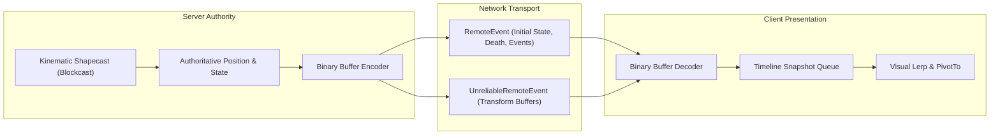
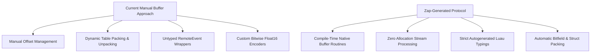

# Lightweight NPC Framework - Networking & Protocol Architecture

## 1. Network Architecture & Authority Model

The framework employs a **strict server-authoritative, client-interpolated network model**:



### Authority & Responsibility Separation
- **Server Responsibilities**:
  - Full authority over unit movement, position, facing angle, velocity, hitpoints, and lifecycle.
  - Frequency-capped replication packing.
  - Per-player visibility flag evaluation (spatial culling).
- **Client Responsibilities**:
  - Zero simulation authority.
  - Time extrapolation based on server timestamps.
  - Timeline snapshot interpolation and visual CFrame application (`PivotTo`).
  - Animation track instantiation and playback.

---

## 2. Current Serialization & Buffer Strategy

Currently, networking relies on custom stream wrappers (`WriteBuffer.luau` and `ReadBuffer.luau`) built over Luau's native `buffer` library, transmitted over generic `RemoteEvent` and `UnreliableRemoteEvent` instances.

### Position Buffer Binary Layout (`MessageId.PositionBuffer`)
```text
 0                   1                   2                   3
 0 1 2 3 4 5 6 7 8 9 0 1 2 3 4 5 6 7 8 9 0 1 2 3 4 5 6 7 8 9 0 1
+-+-+-+-+-+-+-+-+-+-+-+-+-+-+-+-+-+-+-+-+-+-+-+-+-+-+-+-+-+-+-+-+
|          Count (U16)          |       ServerTimestamp (F32)   |
+-+-+-+-+-+-+-+-+-+-+-+-+-+-+-+-+-+-+-+-+-+-+-+-+-+-+-+-+-+-+-+-+
|       ServerTimestamp (cont)  |            NpcID (U16)        |
+-+-+-+-+-+-+-+-+-+-+-+-+-+-+-+-+-+-+-+-+-+-+-+-+-+-+-+-+-+-+-+-+
|  Flags (U8)   |                  Position.X (F32)             |
+-+-+-+-+-+-+-+-+-+-+-+-+-+-+-+-+-+-+-+-+-+-+-+-+-+-+-+-+-+-+-+-+
|                  Position.Y (F32)                             |
+-+-+-+-+-+-+-+-+-+-+-+-+-+-+-+-+-+-+-+-+-+-+-+-+-+-+-+-+-+-+-+-+
|                  Position.Z (F32)                             |
+-+-+-+-+-+-+-+-+-+-+-+-+-+-+-+-+-+-+-+-+-+-+-+-+-+-+-+-+-+-+-+-+
|          Angle (Float16)      |   (Next Entity Record...)     |
+-+-+-+-+-+-+-+-+-+-+-+-+-+-+-+-+-+-+-+-+-+-+-+-+-+-+-+-+-+-+-+-+
```

---

## 3. Zap Protocol Evaluation & Comparison

The project infrastructure includes **Zap** (`rokit.toml`, `wally.toml`). Evaluating Zap against the existing manual buffer implementation highlights major architectural trade-offs:



### Comprehensive Comparison Matrix

| Evaluation Metric | Current Implementation (`WriteBuffer` / `ReadBuffer`) | Proposed Zap-Generated Protocol |
| :--- | :--- | :--- |
| **Simplicity** | Low. Requires 300+ lines of custom bit-shifting code (`Float16`, `AxisAngle`). | **High**. Declarative `.zap` file defining structs and arrays. |
| **Maintainability** | Fragile. Changing field order breaks binary alignment without compiler warnings. | **High**. Changing `.zap` schema automatically updates generated code. |
| **Performance** | Moderate. Manual Luau functions incur call overhead and memory allocations. | **Maximum**. Zap generates inline native `buffer` operations compiled by Rokit. |
| **Type Safety** | None. Payload buffers are passed as untyped `any` over standard remotes. | **Strict**. Full Luau strict types (`export type NpcPositionBatch = ...`). |
| **Debuggability** | Difficult. Corrupted offsets require manual memory inspection. | **Easy**. Human-readable Zap codegen with explicit error catching. |

---

## 4. Proposed Zap Protocol Specification

To replace `WriteBuffer.luau`, `ReadBuffer.luau`, and `MessageId.luau`, we propose defining `zap/unit-replication.zap`:

```zap
opt toolchain = "rokit"
opt server_output = "../src/server/Network/Generated/UnitReplicationServer.luau"
opt client_output = "../src/client/Network/Generated/UnitReplicationClient.luau"

type UnitTransform = struct {
    unitId: u16,
    position: Vector3,
    angle: f16,
}

type UnitAnimationUpdate = struct {
    unitId: u16,
    channel: u8,
    animIndex: u8,
}

event InitialUnitState = {
    from: Server,
    type: Reliable,
    call: SingleAsync,
    data: struct {
        unitId: u16,
        model: Instance,
        replicationHz: u8,
        position: Vector3,
        angle: f32,
    }
}

event UnitPositionBatch = {
    from: Server,
    type: Unreliable,
    call: SingleAsync,
    data: struct {
        serverTime: f64,
        transforms: UnitTransform[],
    }
}

event UnitAnimationBatch = {
    from: Server,
    type: Reliable,
    call: SingleAsync,
    data: struct {
        serverTime: f64,
        animations: UnitAnimationUpdate[],
    }
}

event UnitDespawn = {
    from: Server,
    type: Reliable,
    call: SingleAsync,
    data: struct {
        unitId: u16,
    }
}
```

---

## 5. Networking Redesign Recommendations

1. **Adopt Zap Event Definitions**: Completely replace `WriteBuffer`, `ReadBuffer`, and custom `RemoteEvent` instances with Zap-generated network callers.
2. **Dynamic Frequency Bandwidth Adaptation**: Expand the networking layer to dynamically adjust replication frequency (`replicationHz`) based on client distance or screen frustum visibility.
3. **Delta Compression**: For static units, skip position transmission entirely using bitflags in Zap structs, reducing bandwidth usage to near-zero when units stand still.

---
*Cross-References*:
- For high-level system flow, see [overview.md](file:///C:/Users/Thiago/source/repos/Roblox/rblx-rrw-template/docs/LightweightNpcs/overview.md).
- For client timeline interpolation, see [rendering.md](file:///C:/Users/Thiago/source/repos/Roblox/rblx-rrw-template/docs/LightweightNpcs/rendering.md).
- For replacement framework design, see [migration.md](file:///C:/Users/Thiago/source/repos/Roblox/rblx-rrw-template/docs/LightweightNpcs/migration.md).
