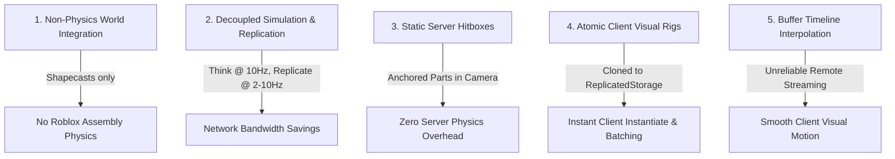
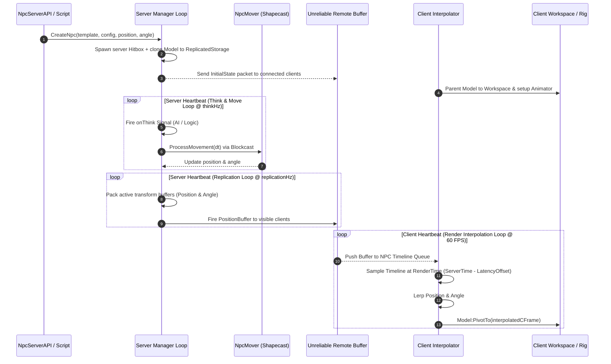

# Lightweight NPC Framework - High-Level System Overview

## 1. Executive Summary & Purpose

The `LightweightNpcs/` framework is an ultra-lightweight entity simulation and custom replication system designed for Roblox. Its primary goal is to render and simulate hundreds of active non-player characters (NPCs) simultaneously on both server and client without triggering the standard Roblox engine CPU, GPU, and network performance bottlenecks.

In standard Roblox development, scaling characters with built-in `Humanoid` instances, physics assemblies, and engine-level property replication rapidly causes severe performance degradation:
- **Server CPU Bottleneck**: `Humanoid` physics state machines and character pathfinding consume heavy server thread time.
- **Client Render Bottleneck**: Complex character rigs with unbatched draw calls degrade framerates.
- **Network Bandwidth Saturation**: Roblox's default property replication streams 60Hz physics transforms and full instance property updates for every part and joint, overloading client buffers.

`LightweightNpcs/` solves this by completely bypassing default Roblox character physics and property replication. It implements a **decoupled, server-authoritative, buffer-streamed entity framework**.

---

## 2. Core Architectural Assumptions

The framework operates under five fundamental design assumptions:

1. **Non-Physics World Integration**: Entities do not participate in Roblox's constraint or physics assembly solvers (`AssemblyLinearVelocity`, `CanCollide` solver). Movement is computed purely via mathematical shapecasting (`Workspace:Blockcast`).
2. **Decoupled Hertz Rates**: Simulation logic ("Think rate", e.g., 10Hz) runs independently of network replication rates ("Replication rate", e.g., 2Hz - 10Hz).
3. **Static Server Footprint**: The server maintains only lightweight collision hitboxes (anchored `Part` instances placed inside a non-rendered container like `Workspace.DoNotReplicate`). Server-side rigs never move or animate visually.
4. **Atomic Client Visual Rigs**: Character models are kept in `ReplicatedStorage` as `ModelStreamingMode.Atomic` templates. Clients clone and position them visually in `Workspace` based on received network updates.
5. **Timeline Buffer Interpolation**: Transform updates are serialized into compact binary buffers, transmitted over `UnreliableRemoteEvent` channels, and smoothly interpolated on clients using buffered timelines.

---

## 3. High-Level System Execution Flow

The end-to-end execution of a unit in the framework follows a strict pipeline:

---

## 4. Problem Solved vs Engine Default Comparison

| Dimension | Default Roblox `Humanoid` Characters | `LightweightNpcs/` Framework |
| :--- | :--- | :--- |
| **Physics Simulation** | Full PGS Physics Solver (Impulses, Constraints, Joints) | Kinematic Shapecasting (`Blockcast`) |
| **Server Footprint** | Complete R15/R6 Model hierarchy per NPC | Single Anchored `Part` Hitbox per NPC |
| **Replication Transport** | Standard Property Replication over Reliable channel (60Hz) | Packed Binary Buffers over Unreliable channel (Configurable Hz) |
| **Animation Overhead** | Server `Animator` tracks & replicates joint motors | Client-only `Animator` driven by network event buffers |
| **Scalability Limit** | ~20 - 50 active NPCs before server tick degradation | **100s - 1,000s of active NPCs** at 60 FPS |

---
*Cross-References*:
- For module breakdown and dependencies, see [architecture.md](file:///C:/Users/Thiago/source/repos/Roblox/rblx-rrw-template/docs/LightweightNpcs/architecture.md).
- For execution lifecycle and state transitions, see [runtime.md](file:///C:/Users/Thiago/source/repos/Roblox/rblx-rrw-template/docs/LightweightNpcs/runtime.md).
- For networking buffers vs Zap analysis, see [networking.md](file:///C:/Users/Thiago/source/repos/Roblox/rblx-rrw-template/docs/LightweightNpcs/networking.md).
