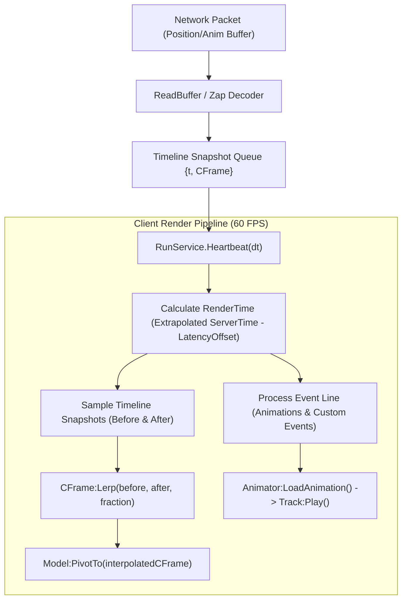
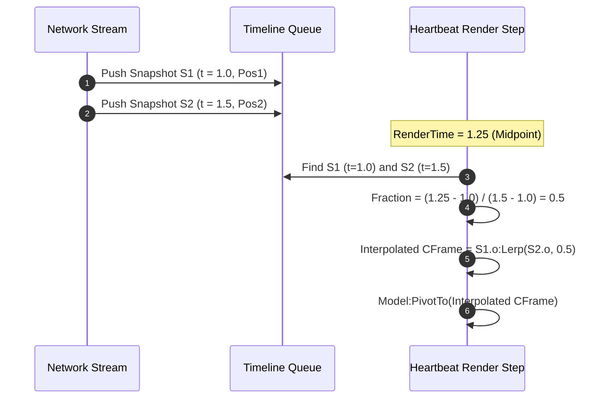

# Lightweight NPC Framework - Visual Presentation & Rendering Pipeline

## 1. Client Visual Architecture

The rendering tier of `LightweightNpcs/` is strictly client-side. The server maintains zero visual instances, motor joints, or animation tracks. Instead, the client receives transform snapshots and event buffers, handling all visual model instantiations, CFrame interpolations, and animation track playbacks.

---

## 2. Model Creation & Rig Batching

To maximize client framerates and minimize render draw calls when rendering hundreds of entities simultaneously, the framework employs specific model setup strategies:

1. **Atomic Model Streaming (`ModelStreamingMode.Atomic`)**:
   - Rigs are stored in `ReplicatedStorage`.
   - Before cloning, `currentInstance.ModelStreamingMode = Enum.ModelStreamingMode.Atomic` is enforced, guaranteeing that all character meshes, accessories, and parts stream to the client as a single atomic unit without partial mesh pop-in.
2. **PrimaryPart Anchoring**:
   - Upon receiving `MessageId.InitialState`, the client anchors the model's `PrimaryPart` (`npcRecord.instance.PrimaryPart.Anchored = true`).
   - Anchoring disables physics assembly calculations on the client, turning the model into a pure kinematic visual shell.
3. **Optimized Custom Rigs ("Robert" and "Bob")**:
   - The framework provides custom low-poly R15 character rigs designed to batch draw calls:
     - **Robert**: Stripped R15 without `Humanoid` overhead. Uses a raw `Animator` instance. Batchable rendering.
     - **Bob**: Ultra-low-poly version of Robert for massive crowds (500+ entities).
     - **StockR15Blocky**: Fallback R15 with standard `Humanoid` (used when character clothing/appearances are required).

---

## 3. Timeline Interpolation Pipeline

Because transform updates arrive at low rates (e.g. 2Hz - 10Hz) over unreliable channels, direct position application would result in heavy visual stutter. The framework implements a **snapshot interpolation pipeline**:

### Timeline Sampling Algorithm
On every client `Heartbeat(dt)`:
1. Calculates `renderTime = extrapolatedServerTime - ((invHz * 2) + bufferFluxEstimation)`.
2. Searches `npcRecord.timeline` array for two consecutive snapshots where `before.t < renderTime` and `after.t >= renderTime`.
3. Computes interpolation fraction:
   $$\text{fraction} = \frac{\text{renderTime} - \text{before.t}}{\text{after.t} - \text{before.t}}$$
4. Calculates interpolated CFrame:
   $$\text{orientation} = \text{before.o:Lerp}(\text{after.o}, \text{fraction})$$
5. Applies CFrame to the visual rig using `npcRecord.instance:PivotTo(orientation)`.

### Underrun & Overrun Fallback Handling
- **Underrun** (Render time is behind oldest snapshot): The client clamps to the oldest available snapshot (`timeline[1].o`).
- **Overrun** (Render time exceeds newest snapshot due to packet loss): The client hides the model by setting `placed = false` and `instance.Parent = nil` to prevent ghosting.

---

## 4. Multi-Channel Animation System

Character animations are driven via an event queue synced with the timeline:

1. **Lazy Animation Loading**:
   - When an NPC first becomes visible and enters the workspace, `ProcessLoad` instantiates `Animation` objects and loads them into the rig's `Animator` via `Animator:LoadAnimation()`.
2. **Channel-Based Playback**:
   - Supports 4 independent animation channels (e.g., Channel 1: Legs/Locomotion, Channel 2: Arms/Actions, Channel 3: Expression).
   - Server streams animation index changes over `MessageId.AnimationBuffer`.
   - Client queues animation events with server timestamps in `npcRecord.eventline`.
   - When `renderTime` reaches the animation event timestamp, `StartAnimation()` stops previous channel tracks and plays the new track.

---

## 5. Client Responsibility Boundary Summary

| Responsibility | Belongs on Client? | Rationale |
| :--- | :--- | :--- |
| **Model Instantiation** | **YES** | Server must not allocate visual models in `Workspace`. |
| **CFrame Interpolation** | **YES** | Smooths low-Hz network streams to match client monitor refresh rate (60/144 FPS). |
| **Animation Track Playback** | **YES** | Joint transformations and mesh deformations belong exclusively to client GPU/CPU. |
| **Spatial Culling** | **YES** | Hides or unparents models when outside client camera frustum or distance thresholds. |
| **Hitbox & Movement Math** | **NO** | Server retains exclusive authority over position, velocity, and collisions. |

---
*Cross-References*:
- For architecture and module APIs, see [architecture.md](file:///C:/Users/Thiago/source/repos/Roblox/rblx-rrw-template/docs/LightweightNpcs/architecture.md).
- For network protocol buffers, see [networking.md](file:///C:/Users/Thiago/source/repos/Roblox/rblx-rrw-template/docs/LightweightNpcs/networking.md).
- For replacement framework design, see [migration.md](file:///C:/Users/Thiago/source/repos/Roblox/rblx-rrw-template/docs/LightweightNpcs/migration.md).
