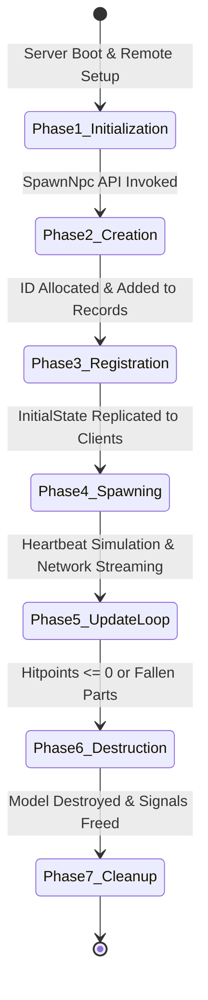
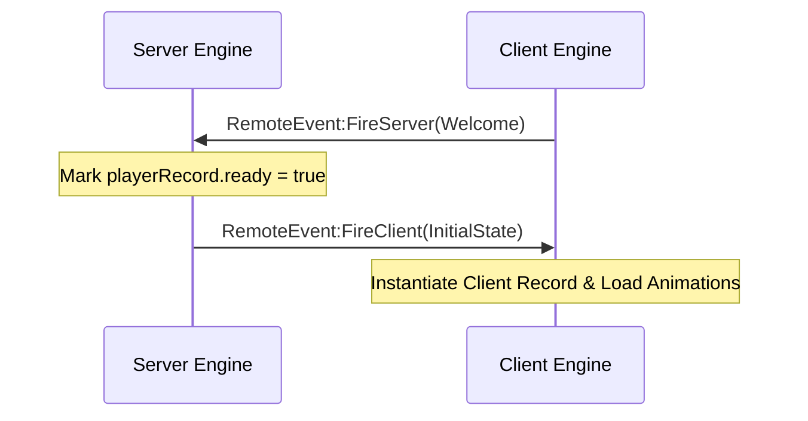
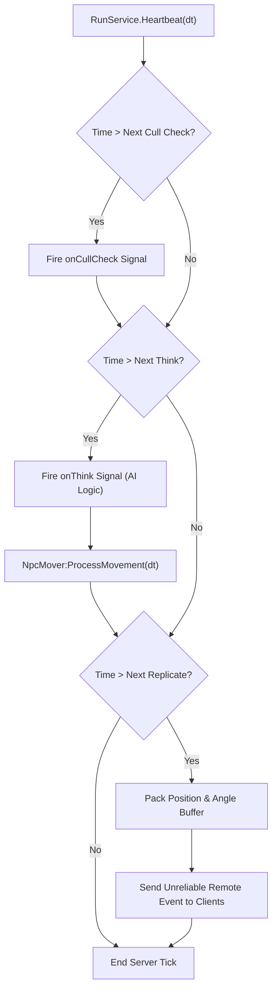

# Lightweight NPC Framework - Runtime Lifecycle & Data Flow

## 1. Unit Lifecycle Overview

An entity in the `LightweightNpcs/` framework progresses through seven discrete lifecycle phases from server initialization to memory garbage collection:

---

## 2. Phase-by-Phase Lifecycle Breakdown

### Phase 1: Engine Initialization
1. **Server Initialization (`Init()` in `LightweightNpcsServerModule.luau`)**:
   - Creates camera container `Workspace.DoNotReplicate` to hold server hitboxes without rendering.
   - Instantiates `RemoteEvent` (`LightweightNpcsRemoteEvent`) and `UnreliableRemoteEvent` (`LightweightNpcsUnreliableRemoteEvent`) in `ReplicatedStorage`.
   - Listens to `Players.PlayerAdded` and `Players.PlayerRemoving`.
   - Captures server start time offset (`timeOffset = tick()`).
2. **Client Initialization (`Init()` in `LightweightNpcsClientModule.luau`)**:
   - Obtains references to `RemoteEvent` and `UnreliableRemoteEvent` in `ReplicatedStorage`.
   - Sends handshake message `{ id = MessageId.Welcome }` to server to signal client readiness.

---

### Phase 2: Unit Creation (`CreateNpc`)
When game scripts invoke `LightweightNpcsServerAPI:SpawnNpc(template, config, position, angle)`:
1. **Hitbox Instantiation**:
   - Creates an anchored server `Part` with size `config.hitBoxSize`.
   - Sets collision group and query properties.
   - Parents hitbox to `Workspace.DoNotReplicate` (or `Workspace` if debug enabled).
2. **Template Rig Cloning**:
   - Clones the visual template model.
   - Sets `ModelStreamingMode.Atomic` to ensure all character parts stream together.
   - Parents visual template to `ReplicatedStorage`.
3. **Record Initialization**:
   - Instantiates `npcRecordConfiguration` and `npcRecordInternal` struct records.
   - Instantiates `Signal` objects: `onThink`, `onFellOffMap`, `onDeath`, `onCleanup`, `onBumpIntoWall`, `onCrashland`, `onCullCheck`.

---

### Phase 3: Registration & ID Allocation
1. Monotonically increments `nextNpcId` counter.
2. Assigns `npcId` attribute to both server `hitBox` and `instance` (`Model:SetAttribute("npcId", npcId)`).
3. Registers `npcRecord` inside global server lookup map `self.npcRecords[npcId]`.

---

### Phase 4: Client Spawning & Initial State Handshake
1. Server loops through all `playerRecords` and calls `SendInitialState(playerRecord, npcRecord)`.
2. Sends reliable packet containing: `npcId`, `instance` model reference, `replicationHzRate`, `position`, `angleRad`, animation indices, and active animation states.
3. Client receives `MessageId.InitialState`:
   - Instantiates `clientNpcRecordType`.
   - Anchors character `PrimaryPart`.
   - Adds record to client lookup table `self.npcRecords[npcId]`.

---

### Phase 5: Dual-Frequency Update Loop

The core update loop operates on two decoupled timers inside `RunService.Heartbeat`:

1. **Simulation Tick (`thinkHzRate`)**:
   - Executes `onThink:Fire(stepTime)`. Game AI scripts update `npcRecord.motionVector` and `npcRecord.jump`.
   - Checks hitpoints and death flags (`CheckForHitpointDeath`).
   - Executes `NpcMover:ProcessMovement(stepTime)` performing `Workspace:Blockcast` physics sweeps.
2. **Replication Tick (`replicationHzRate`)**:
   - Checks if `serverTime > npcRecord.internal.timeOfNextReplicate` or `forceReplicate == true`.
   - Packs active visible NPC positions (`Vector3`) and facing angles (`Float16`) into a binary buffer via `WriteBuffer`.
   - Transmits packet over `UnreliableRemoteEvent` to all visible clients.
3. **Client Interpolation & Render Step**:
   - Client receives buffer and pushes `{ t = serverTime, o = CFrame }` snapshot into `npcRecord.timeline`.
   - On `Heartbeat(dt)`, client calculates `renderTime = extrapolatedServerTime - latencyBufferOffset`.
   - Samples timeline snapshots `before` and `after` `renderTime`, calculates interpolation fraction `frac`, and lerps transform.
   - Applies CFrame using `npcRecord.instance:PivotTo(interpolatedCFrame)`.

---

### Phase 6 & 7: Destruction & Cleanup
1. **Trigger Conditions**:
   - `hitPoints <= 0` triggers `onDeath:Fire()` and sets `deleteFlag = true`.
   - `position.Y < -500` triggers `onFellOffMap:Fire()` and sets `deleteFlag = true`.
2. **Execution (`DestroyNpc`)**:
   - Server fires `onCleanup` signal.
   - Destroys server `instance` model and removes record from `self.npcRecords[npcId]`.
   - Sends reliable `MessageId.Cleanup` event to all clients.
   - Destroys all associated `Signal` objects to prevent memory leaks.
   - Client receives `MessageId.Cleanup`, destroys `onCustomEvent` signal, and deletes local record.

---
*Cross-References*:
- For module APIs and structure, see [architecture.md](file:///C:/Users/Thiago/source/repos/Roblox/rblx-rrw-template/docs/LightweightNpcs/architecture.md).
- For buffer packing and Zap protocol comparison, see [networking.md](file:///C:/Users/Thiago/source/repos/Roblox/rblx-rrw-template/docs/LightweightNpcs/networking.md).
- For client visual rendering and interpolation math, see [rendering.md](file:///C:/Users/Thiago/source/repos/Roblox/rblx-rrw-template/docs/LightweightNpcs/rendering.md).
