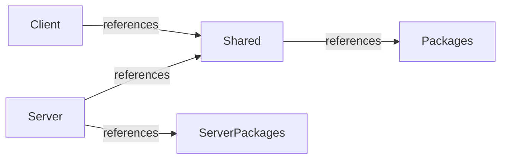

## 1. Project Directory Structure

The project is structured for synchronization via **Rojo** and package management via **Wally** (with **Zap** managed via Rokit). It strictly enforces clear boundaries between client, server, shared logic, assets, and third-party packages.

```text
root/
│
├── docs/                       # Engine documentation & specifications, root files are confirmed current information
│   ├── plan/                   # Rework architectural plans made by ai
│   └── SWOS/                   # Historic SWOS reference docs
│
├── src/    
│   ├── client/                 # Client-only codebase (Visual interpolation, UI, Input)
│   │   ├── Game/               # Vertical slice development of features.
│   │   ├── UI/                 
│   │   ├── Adapters/           # Used to talk to specific packages and roblox engine, making control easier
│   │   └── init.client.luau    # Client bootstrap entry point
│   │
│   ├── server/                 # Server-only codebase (PROPRIETARY ENGINE LOGIC)
│   │   ├── Game/               # Vertical slice development of features.
│   │   ├── Infrastructure/     
│   │   ├── Guards/             # Mostly for Input sanitization, Anti-cheat & buffer guards
│   │   ├── Adapters/           # Used to talk to specific packages and roblox engine, making control easier
│   │   ├── Network/            # Networking for the ServerScriptStorage
│   │   │   └── Generated/      # Zap Generated files
│   │   │
│   │   └── init.server.luau    # Server bootstrap entry point
│   │
│   └── shared/                 # Universal modules (DTOs, Enums, Interfaces ONLY)
│       ├── Core/               # Generic utilities (Signal, Maid, serializers, etc.)
│       ├── Definitions/        # Immutable data that the client needs to present the game
│       ├── Types/              # How should data be structured, dtos, interfaces
│       └── Network/            # Networking for the ReplicatedStorage
│           └── Generated/      # Zap Generated files
│    
├── zap/                        # .zap network files declarations
├── Packages/                   # Wally installed packages (dev & runtime)
├── ServerPackages/             # Wally installed packages (server)
├── Assets/                     # Specific .kra files for artworks
│
├── config.zap                  # Inter client-server networking packets definitions
├── default.project.json        # Rojo place file mapping
├── rokit.toml                  # Rokit toolchain config (Zap CLI)
├── selene.toml                 # Selene std="roblox"
├── wally.lock                  # Locked package versions
└── wally.toml                  # Wally dependency definitions
```

---

## 2. Dependency & Security Rules

To maintain high code quality and prevent technical debt and code leakage, the architecture enforces rigid boundaries:

