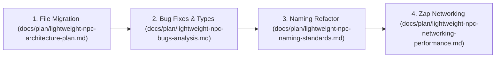

# Lightweight NPC System - Analysis & Refactoring Master Index

## Executive Overview
The analysis of the imported **Lightweight NPC** module (`LightweightNpcs/`) has been conducted and separated into specialized architectural, defect, naming, and networking plans under `docs/plan/` in compliance with [architecture.md](file:///C:/Users/Thiago/source/repos/Roblox/rblx-rrw-template/docs/architecture.md) and [naming-table.md](file:///C:/Users/Thiago/source/repos/Roblox/rblx-rrw-template/docs/naming-table.md).

---

## Analysis & Plan Index

### 1. [Architectural Integration Plan](file:///C:/Users/Thiago/source/repos/Roblox/rblx-rrw-template/docs/plan/lightweight-npc-architecture-plan.md)
- **Scope**: Reorganization of `LightweightNpcs/` files into `src/client/`, `src/server/`, and `src/shared/`.
- **Key Details**: Elimination of `ReplicatedFirst` dependencies, DataModel path requires, and target Rojo mapping configurations.

### 2. [Bugs, Edge Cases & Defect Analysis](file:///C:/Users/Thiago/source/repos/Roblox/rblx-rrw-template/docs/plan/lightweight-npc-bugs-analysis.md)
- **Scope**: In-depth diagnosis of critical runtime bugs.
- **Key Defects**: Animation broadcast clearing loop bug, default visibility truthiness mismatch (`nil == true`), player disconnect memory leak, deprecated `tick()` API, and `RaycastParams` mutation risks.

### 3. [Naming Standards & Code Refactoring Plan](file:///C:/Users/Thiago/source/repos/Roblox/rblx-rrw-template/docs/plan/lightweight-npc-naming-standards.md)
- **Scope**: Symbol and syntax alignment with [naming-table.md](file:///C:/Users/Thiago/source/repos/Roblox/rblx-rrw-template/docs/naming-table.md).
- **Key Refactors**: Module table casing (`NpcServerManager`), method casing (`npcRecord:playAnimation()`), type aliases (`NpcRecord`), and strict `NpcTypes.luau` schema.

### 4. [Networking & Performance Optimization Plan](file:///C:/Users/Thiago/source/repos/Roblox/rblx-rrw-template/docs/plan/lightweight-npc-networking-performance.md)
- **Scope**: Communication layer migration and client rendering performance.
- **Key Upgrades**: Migration from `WriteBuffer`/`ReadBuffer` to **Zap** (`zap/npc-replication.zap`), $O(1)$ ring buffer timeline pruning, and zero-reparenting spatial culling.

---

## Actionable Execution Sequence

