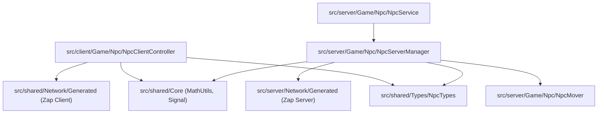

# Lightweight NPC System - Architectural Integration Plan

## 1. Executive Summary & Purpose
This document specifies the target architecture, directory layout, and module boundaries for migrating the **Lightweight NPC** framework (`LightweightNpcs/`) into the main codebase structure (`src/client`, `src/server`, `src/shared`) as required by [architecture.md](file:///C:/Users/Thiago/source/repos/Roblox/rblx-rrw-template/docs/architecture.md).

---

## 2. Directory Layout & Module Migration

### Current Layout (Non-Compliant)
```text
root/
├── LightweightNpcs/
│   ├── replicated-first/      # Misplaced client logic & shared utilities
│   │   ├── Code/
│   │   └── Utils/
│   └── server/                # Server API, mover, & server scripts
│       ├── Code/
│       ├── Rigs/
│       └── LightweightNpcsServerAPI.luau
```

### Target Layout ([architecture.md](file:///C:/Users/Thiago/source/repos/Roblox/rblx-rrw-template/docs/architecture.md) Compliant)
```text
root/
├── src/
│   ├── client/
│   │   └── Game/
│   │       └── Npc/
│   │           └── NpcClientController.luau  # Client timeline interpolation & rendering
│   │
│   ├── server/
│   │   └── Game/
│   │       └── Npc/
│   │           ├── NpcService.luau            # Public server API (spawning, queries)
│   │           ├── NpcServerManager.luau      # Lifecycle, think loop, replication dispatcher
│   │           └── NpcMover.luau              # Physics sweep mover & ground acceleration
│   │
│   └── shared/
│       ├── Core/
│       │   ├── MathUtils.luau                 # Angle and vector math helpers
│       │   └── Signal.luau                    # Standard event signal utility
│       ├── Definitions/
│       │   └── DefaultAnims.luau              # Default animation configurations
│       └── Types/
│           └── NpcTypes.luau                  # Unified server & client type definitions
│
├── zap/
│   └── npc-replication.zap                    # Zap binary network protocol definitions
```

---

## 3. Dependency & Module Boundary Enforcements



### Critical Architectural Enforcements
1. **Eliminate DataModel Path References**: Remove all `game.ReplicatedFirst.LightweightNpcsClient...` and `game.ServerScriptService.LightweightNpcs...` calls. All modules must use standard Luau relative requires or package requires.
2. **Server-Client Boundary**: Server code (`src/server/`) must never directly import from `src/client/` or `ReplicatedFirst`. Shared definitions must sit strictly inside `src/shared/`.
3. **Rojo Configuration**: Update `default.project.json` to delete `ServerScriptService.LightweightNpcs` and `ReplicatedFirst.LightweightNpcsClient` top-level mappings. All NPC files will sync automatically under `Server`, `Client`, and `Shared`.

---
*Related Documents*:
- [Bug Analysis](file:///C:/Users/Thiago/source/repos/Roblox/rblx-rrw-template/docs/plan/lightweight-npc-bugs-analysis.md)
- [Naming & Coding Standards Plan](file:///C:/Users/Thiago/source/repos/Roblox/rblx-rrw-template/docs/plan/lightweight-npc-naming-standards.md)
- [Networking & Performance Plan](file:///C:/Users/Thiago/source/repos/Roblox/rblx-rrw-template/docs/plan/lightweight-npc-networking-performance.md)
